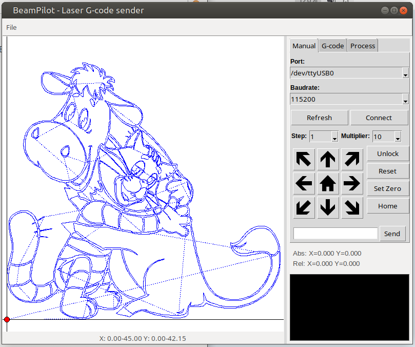
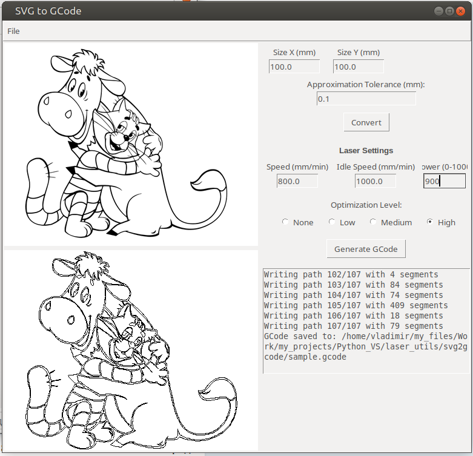
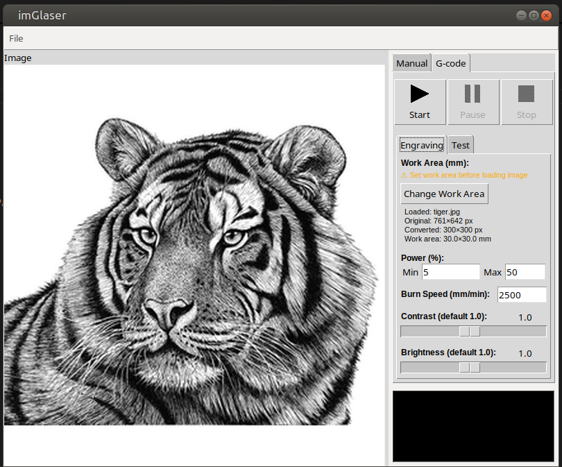
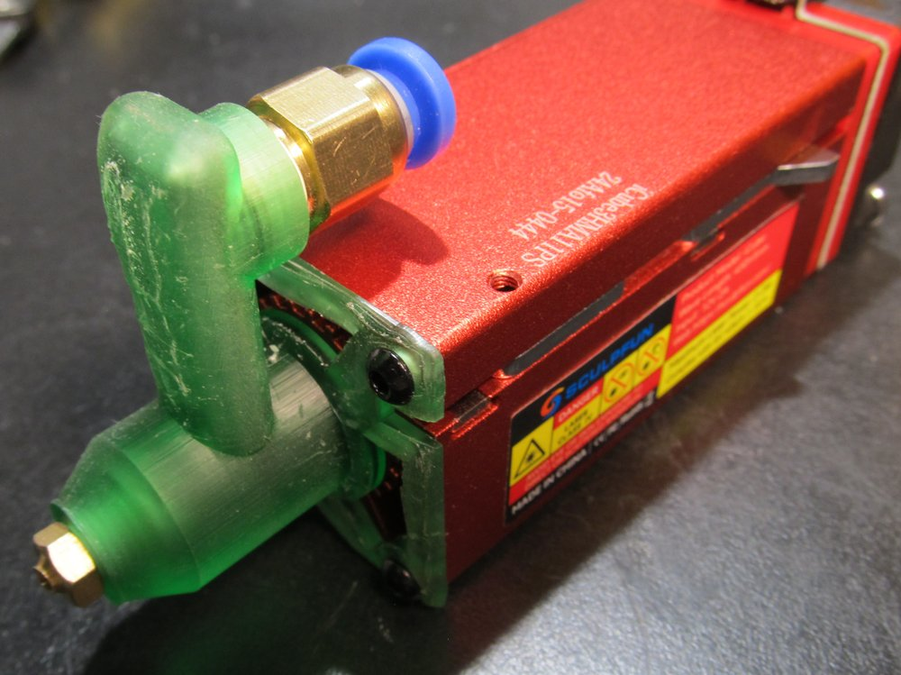
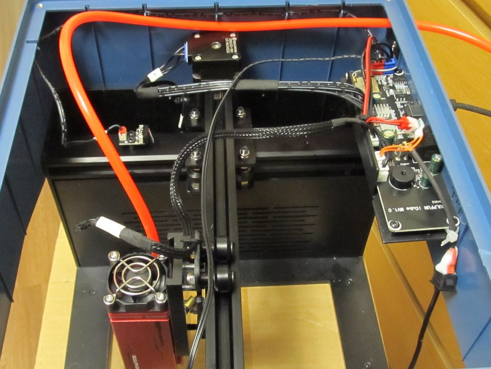
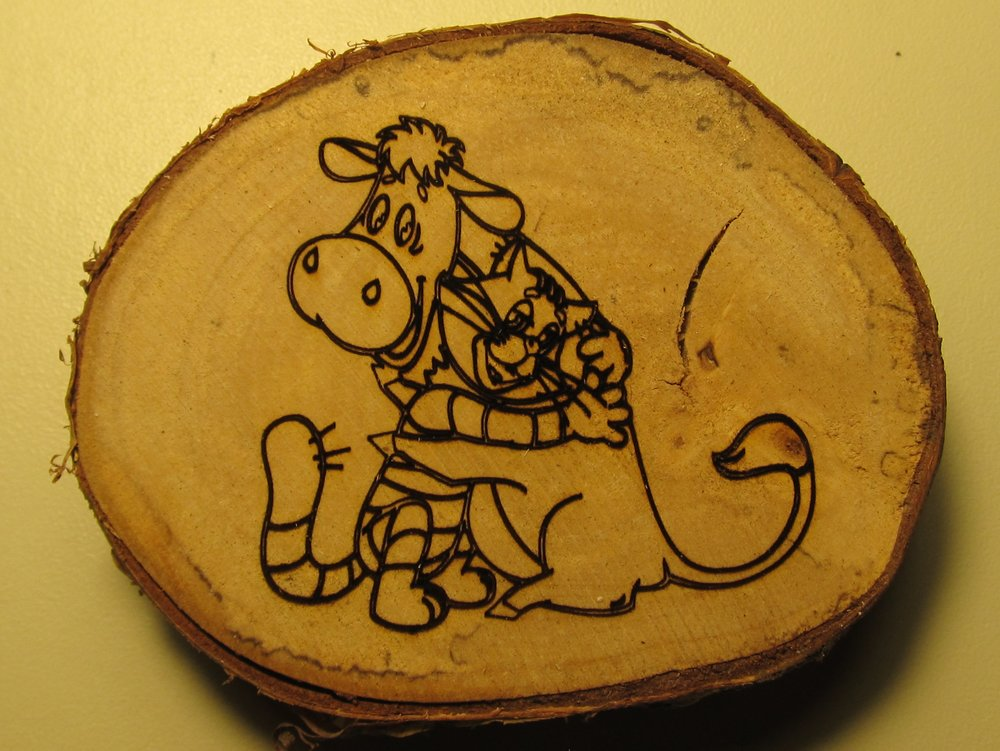
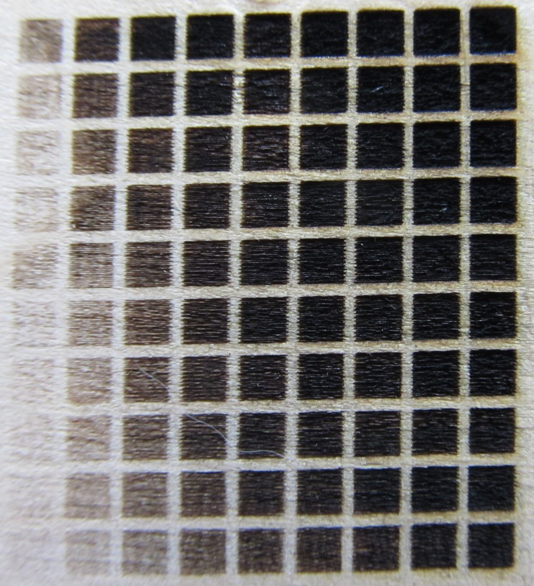

# BeamPilot: Laser G-code Sender, SVG to G-code Converter, Raster Image Engraver, and Air Assist for Sculpfun iCube


This repository contains tools for laser engraving and cutting, designed for GRBL-based controllers like Sculpfun iCube. The project includes four components:

1. **BeamPilot**: Python GUI for sending G-code to laser engravers with real-time visualization, jogging, and G-code processing.
2. **SVG to G-code Converter**: Simple tool (`svg2gcode.py`) to convert SVG files to G-code without complex software.
3. **imGlaser: Raster Image Engraver**: GUI tool (`imGlaser.py`) for grayscale engraving from raster images (JPG, PNG, BMP) with test pattern support.
4. **Air Assist for Sculpfun iCube**: OpenSCAD model (`sculpfun_icube.scad`) for a 3D-printable air assist nozzle (resin printing recommended).

All tools are open-source, tested on Linux (Ubuntu/Debian), and require Python 3. G-code scripts can be used via CLI for automation.

## Features Overview

- **BeamPilot GUI**:
  - Real-time G-code visualization (zoom, pan, position markers).
  - Manual control: Jogging, homing, laser on/off, custom GRBL commands.
  - G-code processing: Fix power, scale, optimize paths, adjust speed/power.
  - Serial monitoring: Live position, command logging, pause/resume.
  - Supports GRBL with absolute/relative coordinates and laser mode.
  - Configurable via `BeamPilot.ini`.


*Main interface of BeamPilot.*

- **SVG to G-code Converter**:
  - Parses SVG paths, applies transformations, generates optimized G-code.
  - Supports scaling, flipping, path optimization (none/low/medium/high).
  - Handles complex SVGs (matrices, rotations, skews).
  - Customizable speed, power, idle moves.


*Main interface of SVG2GCode.*

- **imGlaser: Raster Image Engraver**:
  - Converts raster images to G-code for grayscale engraving.
  - Preprocesses images: Resize, contrast/brightness adjustments.
  - Test mode: Power/speed calibration grids.
  - Serial control: Jogging, homing, real-time monitoring.
  - Pause/resume/stop functionality.


*Main interface of imGlaser.*

- **Air Assist Model**:
  - Designed for Sculpfun iCube: Threaded connectors, ventilation fins, O-ring groove.
  - Parametric OpenSCAD code for customization (diameters, fin count).
  - Enhances engraving/cutting by clearing debris (resin printing recommended).


*OpenSCAD render of Air Assist.*




- **Standalone G-code Scripts**:
  - CLI automation: Path optimization reduces idle travel by up to 50%.
  - Compatible with various laser software outputs.

## Dependencies

- **BeamPilot GUI** (`BeamPilot.py`):
  - `tkinter` (`sudo apt install python3-tk`)
  - `pyserial` (`pip install pyserial`)
  - `configparser` (included with Python)
- **SVG to G-code Converter** (`svg2gcode.py`):
  - `tkinter` (`sudo apt install python3-tk`)
  - `svglib` (`pip install svglib`)
  - `reportlab` (`pip install reportlab`)
  - `Pillow` (`pip install Pillow`)
- **imGlaser** (`imGlaser.py`):
  - `tkinter` (`sudo apt install python3-tk`)
  - `pyserial` (`pip install pyserial`)
  - `Pillow` (`pip install Pillow`)
  - `numpy` (`pip install numpy`)
- **Air Assist Model** (`sculpfun_icube.scad`):
  - [OpenSCAD](https://openscad.org/) (`sudo apt install openscad`)

Create `requirements.txt` with `pyserial`, `svglib`, `reportlab`, `Pillow`, `numpy`, then run:

```
pip install -r requirements.txt
```

## Usage

### 1. BeamPilot: G-code Sender GUI

- Connect to laser via USB serial (e.g., /dev/ttyUSB0, baudrate 115200).
- Load `.gcode`, process (fix power, scale, optimize), and run.
- Features: Jogging (0.1-100mm), homing, real-time visualization (blue: idle, red: executed), pause/resume.

### 2. SVG to G-code Converter (`svg2gcode.py`)

- Run: `python3 svg2gcode.py`.
- Load SVG, set parameters (width/height, speed, power, optimization).
- Generate G-code with headers, absolute positioning, laser commands.

**Example Output**:

```
; GCode generated from SVG
; Original SVG: sample.svg
; Size: 100.000 x 100.000 mm
; Cutting speed: 300 mm/min, Idle speed: 1000 mm/min, Power: 500
G21 ; Set mm mode
G90 ; Set absolute positioning
M5 ; Turn laser off
; Path 1
G0 F1000.0 X10.000 Y20.000
M3 S500
G1 F300.0 X15.000 Y25.000
...
M5 ; Turn laser off
G0 F1000.0 X0.0000 Y0.0000 ; Return to home
M2 ; End program
```

### 3. imGlaser: Raster Image Engraver (`imGlaser.py`)

- Run: `python3 imGlaser/imGlaser.py`.
- Connect to laser, load image (JPG/PNG/BMP), set work area, power, speed.
- Adjust contrast/brightness, or use test mode for calibration grids.
- Start engraving; monitor, pause/resume/stop as needed.

### 4. Air Assist for Sculpfun iCube (`sculpfun_icube.scad`)

- Open in OpenSCAD, render (F6), export STL.
- Print with resin printer, assemble on iCube laser head.
- Customize: Adjust `length`, `fins`, `vent_qty`.

### Standalone G-code Scripts

- `fix_power.py`: Adds M3/M5 around idle moves (`python3 fix_power.py input.gcode 200 fixed.gcode`).
- `adj_power.py`: Scales power in M3 commands (`python3 adj_power.py input.gcode 800 adjusted.gcode`).
- `adj_speed.py`: Scales speeds (`python3 adj_speed.py input.gcode 500 1000 adjusted.gcode`).
- `scale_gcode.py`: Scales to fit dimensions (`python3 scale_gcode.py input.gcode 100 100 scaled.gcode`).
- `optimize_gcode.py`: Minimizes idle travel (`python3 optimize_gcode.py input.gcode optimized.gcode --level 2`).



## Contributing

Provided as-is. Use, modify, or extend at your own risk. No further development or support planned.

## License

MIT License. See LICENSE.

## Acknowledgments

- Built with Python, Tkinter, OpenSCAD.
- Tested on Sculpfun iCube with Linux; may work with other GRBL lasers.







Happy lasering! 🚀
