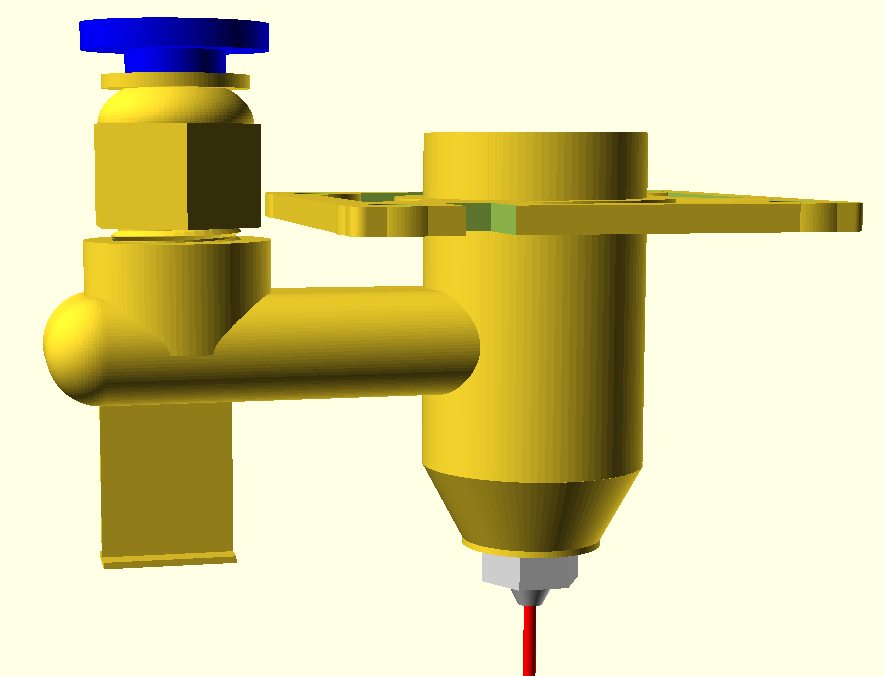

# BeamPilot: Laser G-code Sender, SVG to G-code Converter, and Air Assist for Sculpfun iCube


This repository contains a suite of tools for laser engraving and cutting, primarily designed for GRBL-based controllers like those found in Sculpfun iCube and similar diode lasers. The project is divided into three main components:

1. **BeamPilot**: A Python-based GUI application for sending G-code to laser engravers, with real-time visualization, manual jogging, and integrated G-code processing tools. It leverages several standalone scripts for G-code optimization and adjustment.
2. **SVG to G-code Converter**: A simple, free tool (`svg2gcode.py`) to convert SVG vector files into G-code, emphasizing ease of use without requiring complex software like Inkscape or paid alternatives.
3. **Air Assist for Sculpfun iCube**: An OpenSCAD model (`sculpfun_icube.scad`) for a 3D-printable air assist nozzle, improving cut quality by directing airflow to the laser focus point.

All tools are open-source, tested on Linux (Ubuntu/Debian-based distributions), and require Python 3. The G-code processing scripts can be used independently via command-line for automation.


## Features Overview

- **BeamPilot GUI**:
  - Real-time G-code visualization with zoom, pan, and position markers.
  - Manual control: Jogging, homing, laser on/off, and custom GRBL commands.
  - G-code processing: Fix power commands, scale models, optimize paths, adjust speeds/power.
  - Serial monitoring: Live position updates, command logging, and pause/resume functionality.
  - Supports GRBL controllers with features like absolute/relative coordinates and laser mode.
  - Configurable via INI file for ports, baudrates, and settings persistence.

  
*Main interface of BeamPilot showing G-code visualization, manual controls, and real-time monitoring.*

- **SVG to G-code Converter**:
  - Parses SVG paths, applies transformations, and generates optimized G-code chains.
  - Supports scaling, flipping, and path optimization (none/low/medium/high levels).
  - Handles complex SVGs with matrices, rotations, and skews.
  - Outputs clean G-code with customizable speed, power, and idle moves.

  
*Main interface of SVG2GCode*

- **Air Assist Model**:
  - Custom-designed for Sculpfun iCube: Includes threaded connectors, ventilation fins, and an O-ring groove to prevent air leakage between the laser head and nozzle.
  - Parametric OpenSCAD code for easy customization (e.g., diameters, fin count).
  - Improves engraving/cutting by removing debris and cooling the material.

  
*OpenSCAD render of the Air Assist model.*

- **Standalone G-code Scripts**:
  - Can be run from CLI for batch processing.
  - Features like path optimization reduce idle travel by up to 50% in complex designs.
  - Cross-compatible with various laser software outputs.


*Example SVG input and resulting engraving output.*

## Installation

1. **Prerequisites**:
   - Python 3.8+ (install via package manager, e.g., `sudo apt install python3` on Ubuntu).
   - Required libraries for **BeamPilot GUI** (`BeamPilot.py`):
     - `tkinter`: For GUI (`sudo apt install python3-tk`).
     - `pyserial`: For serial communication (`pip install pyserial`).
     - `configparser`: For INI file handling (usually included with Python).
   - Required libraries for **SVG to G-code Converter** (`svg2gcode.py`):
     - `tkinter`: For GUI (`sudo apt install python3-tk`).
     - `svglib`: For SVG parsing (`pip install svglib`).
     - `reportlab`: For rendering (`pip install reportlab`).
     - `Pillow`: For image handling (`pip install Pillow`).
   - For OpenSCAD model: [OpenSCAD](https://openscad.org/) (`sudo apt install openscad`).
   - Install dependencies: Create a `requirements.txt` with `pyserial`, `svglib`, `reportlab`, `Pillow`, then run:
     ```
     pip install -r requirements.txt
     ```

2. **Clone the Repository**:
   ```
   git clone https://github.com/yourusername/BeamPilot.git
   cd BeamPilot
   ```

3. **Run BeamPilot GUI**:
   ```
   python3 BeamPilot.py
   ```

4. **3D Printing Air Assist**:
   - Open `AirAssist/sculpfun_icube.scad` in OpenSCAD.
   - Export as STL and print (recommended: PLA or PETG, 0.2mm layer height).

## Usage

### 1. BeamPilot: G-code Sender GUI

BeamPilot is the core application for controlling your laser. It connects via USB serial to GRBL devices.

#### Key Functions:
- **Connection**: Select port and baudrate (default: 115200). Supports auto-refresh of available ports (e.g., /dev/ttyUSB0).
- **Manual Control**: Use arrow buttons for jogging (step sizes: 0.1-100mm). Home, unlock, set zero, and toggle laser.
- **G-code Loading**: Open `.gcode` files for visualization and execution.
- **Running G-code**: Play/pause/stop with real-time progress highlighting.
- **Processing Tools** (in "Process" tab):
  - Fix Power: Adds M3/M5 commands for laser control.
  - Scale: Fits G-code to max X/Y dimensions while preserving aspect ratio.
  - Optimize: Reorders paths to minimize idle moves (levels: 0-2).
  - Adjust Speed: Scales working/idle speeds.
  - Adjust Power: Scales laser power values.
- **Monitoring**: Live absolute/relative positions, command log, and warnings (e.g., if max power is 0).

#### How to Use:
1. Launch: `python3 BeamPilot.py`.
2. Connect to your laser (e.g., /dev/ttyUSB0).
3. Load G-code via File > Load GCode.
4. Process if needed (e.g., click "Run Optimize" with level 2 for best results).
5. Click "Run" to start engraving.
6. Monitor progress; pause with "!" or resume with "~".

**Features**:
- Handles large files efficiently.
- Visualizes paths with color-coding (blue: idle, red: executed).
- Persists settings (e.g., last port) in `BeamPilot.ini`.
- Error handling for serial issues and invalid G-code.

**Standalone Scripts Integration**:
BeamPilot calls these scripts internally but you can use them CLI-style (see below).

### 2. SVG to G-code Converter (`svg2gcode.py`)

This tool converts SVG files to G-code, focusing on simplicity. No need for bloated software—just Python and basic libraries.

#### Key Functions:
- Parses SVG elements (paths, transforms).
- Chains segments to reduce jumps.
- Optimizes paths (none/low/medium/high) using a greedy algorithm.
- Outputs G-code with headers, absolute positioning, and laser commands.
- GUI for preview, parameter tweaks (width/height, speed, power, optimization).

#### Features:
- Handles SVG viewBox, matrices, rotations, scales, skews.
- Flips Y-axis for laser coordinate systems.
- Bounding box calculation and scaling.
- Chain optimization: Connects close segments, reverses if needed.
- Terminal logging for progress.

#### How to Use (GUI):
1. Run: `python3 svg2gcode.py`.
2. Load SVG via button.
3. Set parameters: Width/Height (mm), Speed (mm/min), Power (0-1000), Optimization level.
4. Click "Generate GCode" → Outputs `.gcode` in same directory.


**Example Output Snippet**:
```
; GCode generated from SVG
; Original SVG: sample.svg
; Size: 100.000 x 100.000 mm
; Cutting speed: 300 mm/min, Idle speed: 1000 mm/min, Power: 500
G21 ; Set mm mode
G90 ; Set absolute positioning
M5 ; Turn laser off
; Path 1
G0 F1000.0 X10.000 Y20.000
M3 S500
G1 F300.0 X15.000 Y25.000
...
M5 ; Turn laser off
G0 F1000.0 X0.0000 Y0.0000 ; Return to home
M2 ; End program
```

### 3. Air Assist for Sculpfun iCube (`sculpfun_icube.scad`)

  
*3D-printed Air Assist nozzle mounted on Sculpfun iCube laser head.*

A 3D-printable air assist system to enhance laser performance by blowing air at the cut point.

#### Key Functions:
- Mounts on iCube laser head.
- Includes BSPT R1/8" threaded connector for air tube.
- Ventilation fins for cooling.
- O-ring groove to prevent air leakage between laser head and nozzle.
- Parametric: Adjust diameters, fin count, etc.

#### Features:
- Compact: 86mm length, 34mm diameter.
- Efficient airflow.
- Custom threads via `threads.scad` library.
- Fast render mode for testing.

#### How to Use:
1. Open in OpenSCAD: Render with F6.
2. Export STL.
3. Print and assemble: Attach to laser head, connect air tube via push connector.
4. Customize: Edit variables like `length`, `fins`, `vent_qty`.

### Standalone G-code Processing Scripts

These can be used independently for CLI automation. All preserve original formatting where possible.

#### `fix_power.py`
Fixes G-code by adding M3/M5 laser commands around idle moves.
- **Usage**: `python3 fix_power.py input.gcode [power] [output.gcode]`
  - `power`: Laser power (0-255, default 255).
- **Example**: `python3 fix_power.py sample.gcode 200 fixed.gcode`
- **Features**: Detects G0 sequences, adds M5 before idle, M3 after.

#### `adj_power.py`
Scales power (S values) in M3 commands, converts erroneous G1 idle to G0.
- **Usage**: `python3 adj_power.py input.gcode new_max_power [output.gcode]`
- **Example**: `python3 adj_power.py sample.gcode 800 adjusted.gcode`
- **Features**: Scans for max S, applies proportion, preserves formatting.

#### `adj_speed.py`
Scales working/idle speeds (F values), ensures F on first moves.
- **Usage**: `python3 adj_speed.py input.gcode new_max_working [new_max_idle] [output.gcode]`
- **Example**: `python3 adj_speed.py sample.gcode 500 1000 adjusted.gcode`
- **Features**: Tracks laser state, converts G1 idle to G0.

#### `scale_gcode.py`
Scales G-code to fit max dimensions, positions in bottom-left.
- **Usage**: `python3 scale_gcode.py input.gcode max_x max_y [output.gcode]`
- **Example**: `python3 scale_gcode.py sample.gcode 100 100 scaled.gcode`
- **Features**: Normalizes to positive quadrant, maintains aspect ratio.

#### `optimize_gcode.py`
Reorders segments to minimize idle travel.
- **Usage**: `python3 optimize_gcode.py input.gcode [output.gcode] [--level 0|1|2]`
  - `level`: 0 (fast), 1 (medium), 2 (max), default based on size.
- **Example**: `python3 optimize_gcode.py sample.gcode optimized.gcode --level 2`
- **Features**: Greedy + local swaps/reversals, parallel processing for large files.


## Contributing
This project is provided as-is. Feel free to use, modify, or extend it at your own risk. No further development or support is planned, but you are welcome to adapt it for your needs.

## License
MIT License. See [LICENSE](LICENSE) for details.

## Acknowledgments
- Built with Python, Tkinter, and OpenSCAD.
- Tested on Sculpfun iCube with Linux; may work with other GRBL lasers.


Happy lasering! 🚀
